#+options: ^:nil toc:nil

* org
#+begin_src elisp
(org-export-define-derived-backend 'stasis-md 'md
  :translate-alist
  '((template . stasis-md-template)
    (link . stasis-md-link)))

(defun stasis-md-template (contents info)
  (concat
   (format "Title: %s\n" (car (plist-get info :title)))
   (format "Date: %s\n" (car (plist-get info :date)))
   "\n\n"
   contents))

(defun stasis-md-link (link desc info)
  (let ((type (org-element-property :type link)))
    (cond
     ((string= type "file")
      (let* ((path (org-element-property :path link))
             (new-path (replace-regexp-in-string "^\\./resources/public" "" path))
             (new-link (org-element-copy link)))
        (org-element-put-property new-link :path new-path)
        (org-md-link new-link desc info)))
     (t (org-md-link link desc info)))))

(defun my/stasis-export ()
  "Export each top-level heading of the current Org file to its own file."
  (interactive)
  (save-excursion
    (goto-char (point-min))
    (while (re-search-forward "^\\* " nil t)
      (org-narrow-to-subtree)
      (unless (org-in-commented-heading-p)
        (let* ((file (org-export-output-file-name ".md" 'subtree))
               (dir (and file (file-name-directory file))))
          (when file
            (message "Exporting %s..." file)
            (when (and dir (not (file-directory-p dir)))
              (make-directory dir 'parents))
            (org-export-to-file 'stasis-md file nil 'subtree))))
      (widen))))

(defun my/stasis-new (title)
  "Create a new blog post heading with properties."
  (interactive "sTitle: ")
  (let* ((random-id (mapconcat (lambda (_) (format "%x" (random 16))) (make-list 6 nil) ""))
         (date (format-time-string "%Y-%m-%d"))
         (year (format-time-string "%Y"))
         (file-name (format "generated/contents/blog/%s/%s" year random-id)))
    (goto-char (point-max))
    (when (re-search-backward "^\\* COMMENT Local variables" nil t)
      (beginning-of-line))
    (insert (format "* %s\n:properties:\n:export_file_name: %s\n:export_date: %s\n:end:\n\n"
                    title file-name date))))
#+end_src

#+RESULTS:
:results:
my/stasis-new
:end:

* Conao3 Notes
:properties:
:export_file_name: generated/contents/index.md
:export_date: 2024-12-21
:end:

** Links
- GitHub :: https://github.com/conao3
- X(Twitter) :: https://x.com/conao_3
- 技術書典 :: https://techbookfest.org/organization/b48gui73eygdZDs02kqB1C

* Hello Stasis
:properties:
:export_file_name: generated/contents/blog/2024/5a7fcc.md
:export_date: 2024-12-21
:end:

私は conao3.com を持っていて、どうせ何回ブログを作っても飽きるので初めからサブドメインで用意するようにしています。
今までのブログはこんな感じ。

- https://conao3.com :: 2020/05~ hugo製
- https://a.conao3.com :: 2023/03~ astro製
- https://s.conao3.com :: 2024/12~ stasis製

このブログは[[https://github.com/magnars/stasis][stasis]]から生成されています。
stasisはClojureの静的ブログ生成ライブラリで、主張がほとんどない薄いフレームワークです。

descriptionには「Some Clojure functions for creating static websites.」とあります。
その説明通り、提供されているのは単なる関数なので、それを自分で組み合わせてオレオレフレームワークを作ろうぜという世界観です。

ソースは[[https://github.com/conao3/blog-stasis-src][conao3/blog-stasis-src]]においてあります。
ひとまずこんなところで。

* ClojureでEcho Server
:properties:
:export_file_name: generated/contents/blog/2024/4d880f.md
:export_date: 2024-12-23
:end:

ClojureでTCPソケットを使ったプログラムを書きたくなりました。
TCPソケットを使おうと思ったら書くのがEcho Serverですね。書きましょう。

ライブラリなしで書くときはとりあえずcoreのドキュメントを参照します。
https://clojure.github.io/clojure/index.html

しかし、ソケット通信のためのAPIは用意されてないので、javaのドキュメントを参照します。
Clojureが利用しているJDKのバージョンは以下で調べることができます

#+begin_src clojure
(System/getProperty "java.version")
;;=> "21.0.5
#+end_src

JDK21のドキュメントはこちらです。
- https://docs.oracle.com/javase/jp/21/index.html
- https://docs.oracle.com/javase/jp/21/docs/api/index.html

=java.net= を使うことで実装できそうです。

** 調査
まずサーバー側のソケットを作り、 =accept= で待ち受けます。
=accept= は通信要求が来るまでブロッキングされます。

#+begin_src clojure
(def server-socket (java.net.ServerSocket. 15390))
;;=> #'user/server-socket

(def client-socket (. server-socket accept))
;;=> #'user/client-socket
#+end_src

なお、クライアントは =telnet= で試すことができます。
=telnet= は =C-]= を押すと通信を止めることができます。

#+begin_src sh
$ telnet localhost 15390
Trying ::1...
Connected to localhost.
Escape character is '^]'.
#+end_src

サーバー側に戻ります。
=client-socket= を得ることができたら、 =io/reader= と =io/writer= により、ioを得ることができます。
#+begin_src clojure
(def input-stream (io/reader client-socket))
;;=> #'user/input-stream

(def output-stream (io/writer client-socket))
;;=> #'user/output-stream
#+end_src

=io/reader= の返り値のため、 =readLine= などを利用することができます。
#+begin_src clojure
(. input-stream readLine)
;;=> "asdf"
#+end_src

=readLine= は ="\n"= が入力されるまでブロッキングします。

** 実装
調査を受けて、実装はこちらです。

#+begin_src clojure
(ns echo-server.core
  (:require
   [clojure.java.io :as io])
  (:import
   [java.net ServerSocket]
   [java.io BufferedReader BufferedWriter])
  (:gen-class))

(defn handle-client [client-socket]
  (let [input-stream ^BufferedReader (io/reader client-socket)
        output-stream ^BufferedWriter (io/writer client-socket)]
    (loop []
      (let [inpt (. input-stream readLine)]
        (println "Received: " inpt)
        (when (and inpt (not= "" inpt))
          (. output-stream write (str inpt "\n"))
          (. output-stream flush))
        (when-not (nil? inpt)         ; nil indicates EOF
          (recur))))))

(defn start-server []
  (println "Listening localhost:15390")
  (let [server-socket (ServerSocket. 15390)]
    (loop []
      (let [client-socket (. server-socket accept)]
        (println "Connection Accepted")
        (handle-client client-socket))
      (recur))))
#+end_src

もうちょっとClojureらしく書かせて欲しいという感情はありますが、とりあえずこれでできました。

* COMMENT Nix with Commonlisp
:properties:
:export_file_name: generated/contents/blog/2024/fa34f6
:export_date: 2024-12-27
:end:

NixでCommonlispプロジェクトを管理する。
taniさんがテンプレを用意してくれているので、それを使わせてもらう。

#+begin_src elisp
(setq inferior-lisp-program "nix develop --command sbcl")
#+end_src

#+begin_src common-lisp
(:source-registry
 (:tree (:home "dev/repos/cl-paip"))
 :inherit-configuration)
#+end_src

load
#+begin_src common-lisp
(asdf:load-system :paip)
#+end_src

test
#+begin_src common-lisp
(asdf:test-system :paip)
#+end_src

* 日本語レポートから始めるorg-modeとEmacs
:properties:
:export_file_name: generated/contents/blog/2025/f84aea
:export_date: 2025-12-02
:end:

この記事は[[https://qiita.com/advent-calendar/2025/emacs][Emacs Advent Calendar 2025]]の4日目の記事です。

[[https://orgmode.org/][org-mode]]は言わずと知れたEmacsのキラーフィーチャーですが、Emacsの学習曲線もさることながら、org-modeの学習曲線も同様に急峻であるため入門したくても踏み切れないという初心者の方がたくさん居るという声を聞きます。
しかし、タイトルにもありますが、日本語レポートから始めるorg-modeでゆるやかにorg-mode、しいてはEmacsに入門するのは私がとてもおすすめしている入門経路で、実は私もこの経路でorg-modeとEmacsに入門しています。

ぜひ怖がらずに入門してみましょう。

** 日本語レポートの題材
なんでも良いのですが、[[https://tcs.c.titech.ac.jp/csbook/c_lang/chap1.html][東工大のC言語入門]]を見つけたのでこれを使わせてもらうことにします。

** Emacsの起動とファイルの準備
Emacsをインストールして起動してください。
Nixをインストールしている方は以下のコマンドでEmacsがインストールされている環境に入ることができます。

#+begin_src shell
nix shell nixpkgs#emacs
#+end_src

その後、 =emacs= で起動できます。

#+begin_src shell
emacs
#+end_src

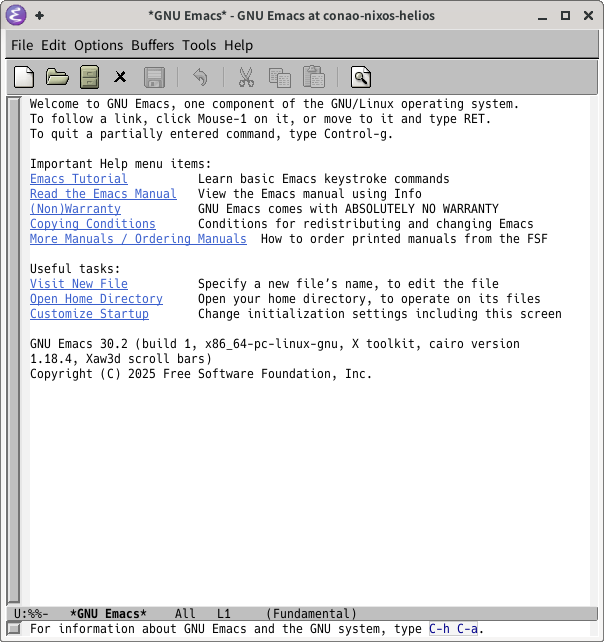

=C-x C-f (find-file)= を実行してファイルを開きます。存在しないパスを指定すると空のファイルとして開くことができます。

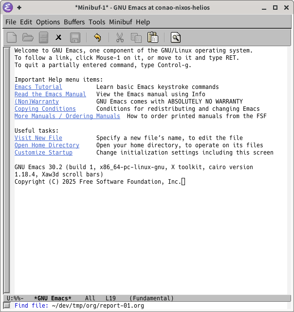

ここでもしフォルダが存在していない場合は以下のようなメッセージが表示されます。

> Use M-x make-directory RET RET to create the directory and its parents

この通りに実行してフォルダを作ることもできますし、保存時にフォルダを作るか尋ねられるので、そこでyと答えてもOKです。

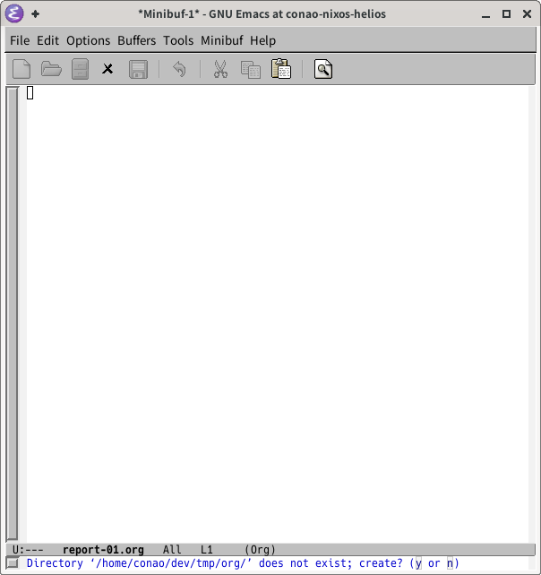

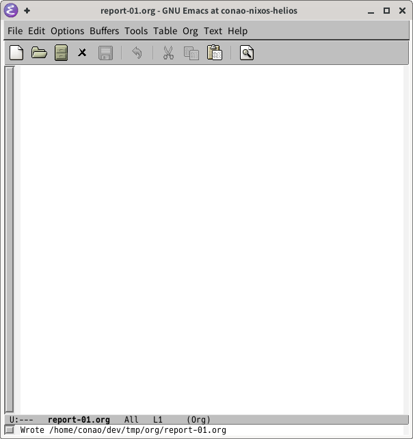

** org-modeの文法
[[https://orgmode.org/features.html][features]]のページがざっと全体像になっています。
レポートを書くという目的ではheadingの作り方といくつかの文字装飾の方法を学んでおくと良いでしょう。
markdownとの対応で記述します。

*** headingの作り方
markdownでは =#= を使いますが、org-modeでは =*= を利用します。 =M-RET= で挿入することができ、heading上にポインタがある状態で =M-←= や =M-→= でレベルの変更ができます。

h1は =*= 、h2では =**= というように重ねて深いレベルを表現するところは同じです。

なおmarkdownと同じく、改行は無視され、空行を入れることで段落分けを表現します。
そのため、headingの間は自由な量の空行を入れることができます。

#+begin_src org
,* heading 1
ほんぶん1
,** heading 1.1
ほんぶん1.1
,** heading 1.2
ほんぶん1.2

,* heading 2
,** heading 2.1
,** heading 2.2
#+end_src

*** 文字装飾
(本当はそのまま表示したかったけどレンダリングを止められなかったのでコードブロックで。)

#+begin_src org
| markdown     | org-mode     | rendered   |
|--------------+--------------+------------|
| =`code`=     | ==code==     | =code=     |
| =*emphasis*= | =/emphasis/= | /emphasis/ |
| =**strong**= | =*strong*=   | *strong*   |
| =~~strike~~= | =+strike+=   | +strike+   |
#+end_src

*** リスト
markdownと同じく =-= でリストを作ることができます。
=-= のリスト上にポインタがあるとき、 =M-RET= で追加の =-= を挿入することができます。
headingと同じく、リスト上にポインタを置いた上で =M-←= と =M-→= でリストの深さを変更することができます。

#+begin_src org
- apple
- banana
- orange
  - orange2
#+end_src

- apple
- banana
- orange
  - orange2

*** リンク
markdownでは =[link text](link)= と表現するところ、org-modeでは =[[link][link text]]= と表現します。
逆になっているので注意しましょう。

もしくは =link text= と書いて選択した後、 =C-c C-l (org-insert-link)= を実行することで、対話的にリンクを作ることができます。

[[https://orgmode.org/][org-mode]]へのリンクです。

*** テーブル
テーブルはmarkdownと同じくasciiで表現します。

テーブルヘッダはあってもなくても良く、作る場合は =-= で区切ります。
ただし、この表記を全て自分で整えなくても良く、ある程度書いたら =C-c C-c= を押すことでorg-modeに整えてもらうことができます。

#+begin_src org
| 名前    | 説明         |
|---------+--------------|
| table   | テーブル     |
| caption | キャプション |
#+end_src

| 名前    | 説明         |
|---------+--------------|
| table   | テーブル     |
| caption | キャプション |

*** コードブロック
org-modeでのコードブロックは拡張性があるがゆえにに少し冗長に感じるかもしれません。
markdownでは =``` 言語= と =```= で囲むことによって表現しますが、org-modeでは =#+begin_src 言語= と =#+end_src= で囲うことによって表現します。

#+begin_src org
,#+begin_src python
print("hello")
,#+end_src
#+end_src

#+begin_src python
print("hello")
#+end_src

言語の指定がなく、単にコードブロックとして表現したい場合は =#+begin_example= と =#+end_example= で囲います。

#+begin_src org
,#+begin_example
こーど
ブロック
,#+end_example
#+end_src

#+begin_example
こーど
ブロック
#+end_example

*** 脚注
markdownでは =foo[^foo]= と =[^foo]: fooに対しての脚注= と書きますが、org-modeは =foo[fn::fooに対しての脚注]= と表記します。

こんな感じ[fn::どんな感じ？]になります。

*** メタ設定
org文書に対してタイトルなどを指定することができます。
基本的にはファイルの先頭に書くことが多いです。

#+begin_src org
,#+title: 文書のタイトル
,#+author: conao3
,#+date: 2025-12-02
#+end_src

設定できる項目の一覧は[[https://orgmode.org/manual/Export-Settings.html
][ドキュメント]]にあります。
設定できてもエクスポートに利用する形式でサポートされていないと単に無視されることもあります。

** レポートを書こう
ここまで学んだ文法を元にorg-modeでレポートを書いてみましょう。

#+begin_src org
,#+title: C言語入門01 - プログラミングの準備
,#+author: conao3
,#+date: 2025-12-02

,* 演習問題回答
,** 演習1-1
,#+begin_example
以下のプログラムをコンパイル・実行すると、どのような表示がされるか確認してください。

#include <stdio.h>

int main() {
    printf("2 * 8 = %d\n", 2 * 8);
    printf("36 = %d * %d\n", 3, 12);
    return 0;
}
,#+end_example

回答

,#+begin_example
2 * 8 = 16
36 = 3 * 12
,#+end_example

,** 演習1-2
,#+begin_example
以下のプログラムをコンパイルするとコンパイルエラーが発生します。
コンパイルエラーが発生する理由を考えて、修正方法を考えてください。

#include <stdio.h>

int main() {
    printf("The quick brown fox
            jumps over
            the lazy dog.");
    return 0;
}
,#+end_example

文字列の終端なしに行の終わりになっているため、エラーが発生する。
修正方法としては =\= を行末に置き、行継続していることを表現することでエラーを修正できる。

,#+begin_src C
    printf("The quick brown fox\
            jumps over\
            the lazy dog.");
,#+end_src

,** 演習1-3

,#+begin_example
以下のプログラムと同じ表示をするプログラムをprintf 関数を
1 回しか使わずに記述してください。

ヒント: \n は文字列の途中に書くこともできます。

#include <stdio.h>

int main() {
    printf("%d apples\n", 4);
    printf("%d apples\n", 9);
    printf("%d apples\n", 16);
    return 0;
}
,#+end_example

回答

,#+begin_src C
#include <stdio.h>

int main() {
    printf("%d apples\n%d apples\n%d apples\n", 4, 9, 16);
    return 0;
}
,#+end_src

,#+begin_example
4 apples
9 apples
16 apples
,#+end_example
#+end_src

** エクスポートしてみよう
残念ながらorg-modeの形式では教授は受け取ってくれません。
しかし、org-modeから種々のフォーマットに変換することでその問題を解決することができます。

テキストフォーマットはもちろん、markdownやhtml、man形式やLaTeX形式など様々なフォーマットが[[https://orgmode.org/manual/Exporting.html][org-mode本体によりサポート]]されています。
なお、筆者はこの機能でLaTeXにエクスポートし卒論を書きました。

さらにはコミュニティにより他にも様々なフォーマットへの変換がサポートされています。
エクスポートパッケージは =ox=- を付けることが慣習のため、[[https://melpa.org/#/?q=ox-][MELPAでこのクエリを入れて検索]]すると追加で実に40種ほどのエクスポート先を利用することができます。
その中には私が作成した [[https://zenn.dev/conao3/articles/ox-zenn-usage][ox-zenn]] もあります。

今回は簡単にテキストフォーマットのエクスポートを試してみましょう。
org-modeの文書を開いた状態で、 =C-c C-t (org-export-dispatch)= を実行します。

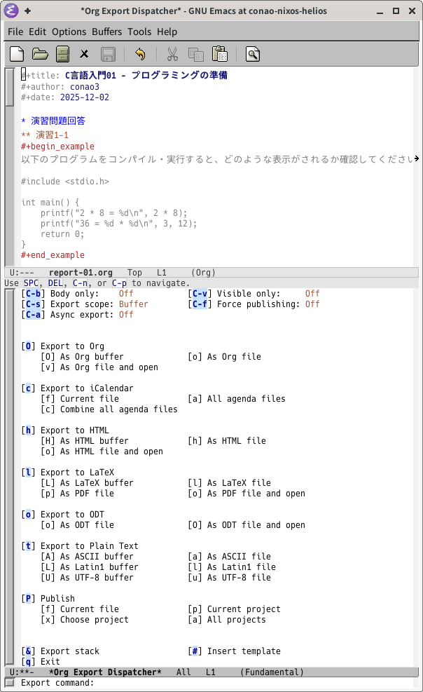

そうすると現在エクスポート可能な一覧が表示されるので、今回は =t A= と入力してasciiでのテキストフォーマットにエクスポートしてみましょう。その結果がこちらです。

#+begin_example
                  ____________________________________

                   C言語入門01 - プログラミングの準備

                                 conao3
                  ____________________________________


                               2025-12-02


Table of Contents
_________________

1. 演習問題回答
.. 1. 演習1-1
.. 2. 演習1-2
.. 3. 演習1-3


1 演習問題回答
==============

1.1 演習1-1
~~~~~~~~~~~

  ,----
  | 以下のプログラムをコンパイル・実行すると、どのような表示がされるか確認してください。
  | 
  | #include <stdio.h>
  | 
  | int main() {
  |     printf("2 * 8 = %d\n", 2 * 8);
  |     printf("36 = %d * %d\n", 3, 12);
  |     return 0;
  | }
  `----

  回答

  ,----
  | 2 * 8 = 16
  | 36 = 3 * 12
  `----


1.2 演習1-2
~~~~~~~~~~~

  ,----
  | 以下のプログラムをコンパイルするとコンパイルエラーが発生します。
  | コンパイルエラーが発生する理由を考えて、修正方法を考えてください。
  | 
  | #include <stdio.h>
  | 
  | int main() {
  |     printf("The quick brown fox
  |             jumps over
  |             the lazy dog.");
  |     return 0;
  | }
  `----

  文字列の終端なしに行の終わりになっているため、エラーが発生する。修正方
  法としては `\' を行末に置き、行継続していることを表現することでエラー
  を修正できる。

  ,----
  | printf("The quick brown fox\
  |         jumps over\
  |         the lazy dog.");
  `----
#+end_example

このようにテキストファイルとしてフォーマットされ、目次やタイトルが挿入され、地の文は適切に折り返した状態で出力されます。
編集時はエディタ側で折り返すけれどもエクスポート時はこのように特定の桁で改行を入れておく方がテキストファイルとしては適しています。

UTF-8でエクスポートした結果がこちらです。

#+begin_example
                  ━━━━━━━━━━━━━━━━━━━━━━━━━━━━━━━━━━━━
                   C言語入門01 - プログラミングの準備

                                 conao3
                  ━━━━━━━━━━━━━━━━━━━━━━━━━━━━━━━━━━━━


                               2025-12-02


Table of Contents
─────────────────

1. 演習問題回答
.. 1. 演習1-1
.. 2. 演習1-2
.. 3. 演習1-3


1 演習問題回答
══════════════

1.1 演習1-1
───────────

  ┌────
  │ 以下のプログラムをコンパイル・実行すると、どのような表示がされるか確認してください。
  │ 
  │ #include <stdio.h>
  │ 
  │ int main() {
  │     printf("2 * 8 = %d\n", 2 * 8);
  │     printf("36 = %d * %d\n", 3, 12);
  │     return 0;
  │ }
  └────

  回答

  ┌────
  │ 2 * 8 = 16
  │ 36 = 3 * 12
  └────
#+end_example

このようにUTF-8の文字が使われ、asciiのものと比べると少しリッチなフォーマットになりました。

最後にHTMLでのエクスポートを試してみましょう。 =C-c C-e= の後、 =h o= でHTMLファイルで書き出してブラウザで開くところまでを実行してくれます。

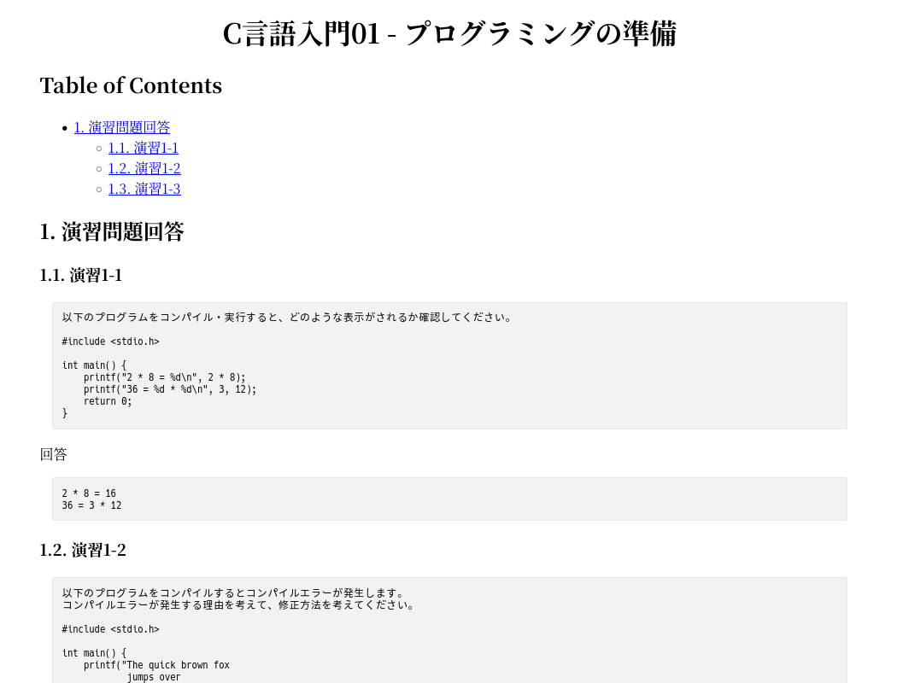

このようなスタイルのWebページを見たことはないでしょうか。もしかしたらそのページはorg-modeから書き出されたページかもしれません。

** 発展
ここまでの内容でも普通に便利にorg-modeを利用できていると言って過言ではないと思います。
ここからorg-modeの機能を少しずつ学んで行くことができるでしょう。

この日本語レポートが書けるようになった読者に次の一歩としておすすめなorgの機能は =babel= です。
babelはいわゆる「文芸的プログラミング」をサポートする機能で、「[[https://www.jstatsoft.org/article/view/v046i03][A Multi-Language Computing Environment for Literate Programming and Reproducible Research]]」で紹介 (というかorg-modeで論文あるのすごくないか) されているところの「Code Evaluation」にあたる機能です。

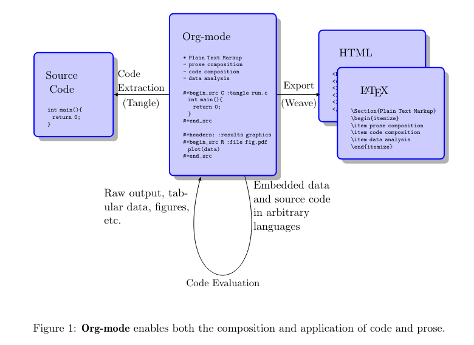

この機能を使うことで文書内に任意のプログラミング言語のブロックを挿入し、エクスポート時に実行することで実際のエクスポートの内容を決定するということができるようになります。

例えば以下のように記述することでエクスポート時にC言語ソースのコンパイルから実行まで自動で行い、結果をその↓のコードブロックとして挿入するということが実現できます。

#+begin_src org
回答

,#+begin_src C :includes stdio.h :results output :exports results
printf("2 * 8 = %d\n", 2 * 8);
printf("36 = %d * %d\n", 3, 12);
,#+end_src
#+end_src

エクスポートもしくはこのコードブロックで =C-c C-c= を押すと実行され、結果がコードブロックとして埋め込まれた状態がこちらです。

#+begin_src org
,#+begin_src C :includes stdio.h :results output :exports results
printf("2 * 8 = %d\n", 2 * 8);
printf("36 = %d * %d\n", 3, 12);
,#+end_src

,#+RESULTS:
: 2 * 8 = 16
: 36 = 3 * 12
#+end_src

=:exports results= の指定をしてあるため、エクスポートした文書には結果のみが出力されます。
レポートの回答としては結果のみが求められていたのでこれで良いですね。

という感じで =babel= を導入するのはジャンプが少ないかなと思います。
論文の図に戻ると、右側の矢印はExportで既に扱っているため、残すは左の矢印のみです。
これは =tangle= と呼ばれ、このコードブロックを「抽出」してソースファイル化するというものです。

抽出したソースファイルの場所も当然のことながら指定できるため、つまりorg文書というドキュメントから複数のソースファイルを書き出せるという機能です。

tangleの利用例についてはたけてぃが最近は活発に記事を書いてくれているので興味があればぜひ。
https://www.google.com/search?q=tangle+site%253Ahttps%253A%252F%252Fwww.takeokunn.org

org-modeの機能は今回扱った文書としての使い方が大きなものではありますが、同じくらい大きな機能として本格的なGTD (Get Things Done) での利用に耐えうる程のタスク管理機能があります。
正直筆者もまだ使いこなせていないので手に馴染んだらまた紹介しようと思います。

** まとめ
org-modeから始めるEmacs入門を書きました。
個人的には私のEmacs入門のパスがこれなので、ずっと書きたかった記事です。
Emacsでいきなりコードを書き始めるのではなく、まずは日本語から書いてみてはどうかという趣旨です。

この記事を見てorg-modeに、そしてEmacsに入門してみようかなという人が一人でも増えてくれたらいいなと思います。

* COMMENT ClojureのIO, Stream回りの整理
:properties:
:export_file_name: generated/contents/blog/2025/68a957
:export_date: 2025-11-27
:end:

ClojureはJavaで動作するため、Javaとの相互運用のために便利な仕組みが用意されています。
特にIO回りはホスト言語に依存する要素が多いため専用のネームスペースである =clojure.java.io= も用意されています。

javaの概念とClojureの抽象化がどのように対応しているのか整理します。

なお、この記事においては直近の日本語ドキュメントがあるLTSの[[https://docs.oracle.com/javase/jp/21/index.html][JDK21]]を前提にします。

** JavaのIO
Javaには主要なIOのパッケージが2つあります。 =java.io= と =java.nio= です。
=java.io= は =java.nio= で置き換えられたということではなく、より高パフォーマンスで利便性の高いパッケージとして導入されています。

特にファイル操作に関しては =java.nio= を利用することで便利になりますが、IOについては =java.io= の範囲で十分です。

=java.io= の各クラスの継承関係は[[https://docs.oracle.com/javase/jp/21/docs/api/java.base/java/io/package-tree.html][javadoc]]で見ることができます。

重要クラスは =InputStream=, =OutputStream=, =Reader=, =Writer= です。
これだけに絞って抜き出すとこのような関係になっています。

- InputStream (Closeableを実装)
  - ByteArrayInputStream
  - FileInputStream
  - FilterInputStream
    - BufferedInputStream
    - DataInputStream (DataInputを実装)
    - LineNumberInputStream
    - PushbackInputStream
  - ObjectInputStream (ObjectInput、ObjectStreamConstantsを実装)
  - PipedInputStream
  - SequenceInputStream
  - StringBufferInputStream
- OutputStream (Closeable、Flushableを実装)
  - ByteArrayOutputStream
  - FileOutputStream
  - FilterOutputStream
    - BufferedOutputStream
    - DataOutputStream (DataOutputを実装)
    - PrintStream (java.lang.Appendable、Closeableを実装)
  - ObjectOutputStream (ObjectOutput、ObjectStreamConstantsを実装)
  - PipedOutputStream
- Reader (Closeable、java.lang.Readableを実装)
  - BufferedReader
    - LineNumberReader
  - CharArrayReader
  - FilterReader
    - PushbackReader
  - InputStreamReader
    - FileReader
  - PipedReader
  - lStringReader
- Writer (java.lang.Appendable、Closeable、Flushableを実装)
  - BufferedWriter
  - CharArrayWriter
  - FilterWriter
  - OutputStreamWriter
    - FileWriter
  - PipedWriter
  - PrintWriter
  - StringWriter

=InputStream= がバイト単位で入力できる基本のクラスで、 =Reader= はcharsetを設定して文字列として入力できるという関係になっています。

** java.ioを直接使う
Clojureのinteropを使って、java.ioを直接使ってみましょう。

以下のテキストを =sample.txt= として保存します。
#+begin_src text
あ
#+end_src

=sample.txt= を =java.io.FileInputStream= で読み込みます。

#+begin_src clojure
(import '[java.io FileInputStream])
;;=> java.io.FileInputStream

(def f (java.io/FileInputStream. "sample.txt"))
;;=> #'user/f

(.read f)
;;=> 227

(.read f)
;;=> 129

(.read f)
;;=> 130

(.read f)
;;=> 10

(.read f)
;;=> -1

(.close f)
;;=> nil
#+end_src

このようにバイト単位で読み込み、読み込めるデータがないときは =read()= は =-1= を返却します。
使い終わったら =close()= を呼んで閉じておきましょう。

=FileReader= はReaderのため、charsetを考慮できます。
charsetを渡さない場合は =java.nio.charset.Charset/defaultCharset()= で返却される値が利用されます。

#+begin_src clojure
(do (import '[java.io FileInputStream FileReader])
    (import '[java.nio.charset Charset]))

(java.nio.charset.Charset/defaultCharset)
#object[sun.nio.cs.UTF_8 0xd9f1005 "UTF-8"]

(def f (java.io/FileReader. "sample.txt"))
;;=> #'user/f

(def f (java.io/FileReader. "sample.txt" (java.nio.charset.Charset/forName "UTF-8")))
;;=> #'user/f

(.read f)
;;=> 12354

(.read f)
;;=> 10

(.read f)
;;=> -1

(.close f)
;;=> nil
#+end_src

* COMMENT ClaudeCodeのブラウザフロントエンドを作る
:properties:
:export_file_name: generated/contents/blog/2025/1488a7
:export_date: 2025-12-03
:end:

ClaudeCode

* Nixpkgsでのアップデート作業
:properties:
:export_file_name: generated/contents/blog/2025/b1a436
:export_date: 2025-12-14
:end:

nixpkgsに登録されているclj-kondoが少し古いバージョンだった。
nixpkgsを更新するために調べたのでメモ。

** 結論
[[https://github.com/Mic92/nix-update][nix-update]] を使えば良い。
特にグローバルに入れる必要もなく、nix runから直接起動すると良い。

#+begin_src sh
nix run nixpkgs#nix-update -- clj-kondo --build --commit
#+end_src

** Tips
おそらくこのツールで作られたPRが [[https://github.com/NixOS/nixpkgs/pull/455542][NixOS/nixpkgs#455542]] 。
このPRがnixpkgsの各ブランチにshipされたかどうかを追跡する以下のような便利サイトがある。

- https://nixpk.gs/pr-tracker.html?pr=455542
- https://nixpkgs-tracker.ocfox.me/?pr=455542

* Nixで始めるemacsclient
:properties:
:export_file_name: generated/contents/blog/2026/26583e
:export_date: 2026-01-24
:end:

Emacsを使っていると、シェルから現在のEmacsのインスタンスを使ってファイル編集したいことがあります。

そこで登場するのがemacsclientです。
Emacsをサーバーとして常駐させておき、クライアントから接続することで瞬時にファイルを開くことができます。

この記事ではNixOSのservices.emacsを利用して、簡単にemacsclient環境を構築する方法を紹介します。

ref: [[https://github.com/NixOS/nixpkgs/blob/master/nixos/modules/services/editors/emacs.md][nixpkgs/nixos/modules/services/editors/emacs.md at master · NixOS/nixpkgs · GitHub]]

** emacsclientとは
Emacsはサーバー/クライアントモデルをサポートしています。
通常Emacsを起動すると独立したプロセスとして動作しますが、サーバーモードで起動することでバックグラウンドで常駐させることができます。

その後、emacsclientコマンドを使うことで既に起動しているEmacsサーバーに接続し、新しいフレームやバッファでファイルを開くことができます。

** 検証環境
:PROPERTIES:
:ID:       5bca7858-d433-4930-b520-0d6b78d34b80
:END:
NixOSを使っていない人でも試せるよう、NixのFlakeを使ってQEMU上でNixOS VMを起動する環境を用意します。
もちろんNixOSを既に使っている場合は、自分の =configuration.nix= に直接設定を追加すれば良いです。

今回の検証環境は最小限のXfceデスクトップ環境を持つVMで、Emacsのサーバー/クライアント機能を試すのに十分な環境となっています。

flake.nix
#+begin_src nix
{
  inputs.nixpkgs.url = "github:nixos/nixpkgs/nixos-unstable";

  outputs = { self, nixpkgs }: {
    nixosConfigurations.minimal-vm = nixpkgs.lib.nixosSystem {
      system = "x86_64-linux";
      modules = [ ./configuration.nix ];
    };

    packages.x86_64-linux.default = self.nixosConfigurations.minimal-vm.config.system.build.vm;
  };
}
#+end_src

configuration.nix
#+begin_src nix
{ modulesPath, pkgs, ... }: {
  imports = [ (modulesPath + "/virtualisation/qemu-vm.nix") ];

  system.stateVersion = "24.11";

  users.users.demo = {
    isNormalUser = true;
    extraGroups = [ "wheel" ];
    initialPassword = "demo";
  };

  services.xserver.enable = true;
  services.xserver.desktopManager.xfce.enable = true;
  services.xserver.desktopManager.xfce.enableScreensaver = false;

  environment.systemPackages = with pkgs; [ git ];
}
#+end_src

この2ファイルを置いて、以下のコマンドでVMを起動できます。

#+begin_src shell
QEMU_OPTS="-m 8192 -smp 4" nix run
#+end_src


#+DOWNLOADED: screenshot @ 2026-01-24 14:40:56
[[file:resources/public/img/42afe4e0-4c5c-0b43-1d32-56bbbcc695ab.png]]

以降、基本的にconfiguration.nixを編集することになります。

** 設定
=services.emacs= を有効化することで、ユーザーログイン時に自動的にEmacsサーバーが起動するようになります。

configation.nix
#+begin_src nix
{
  services.emacs = {
    enable = true;
    defaultEditor = true;
  };
}
#+end_src

この設定でOS起動時に同時にemacsclientを起動することができます。

さらに =defaultEditor= を設定することで =EDITOR= をemacscilentを利用するように設定できるため、 =EDITOR= を利用するソフトウェアとも透過的にemacsclientを利用することができます。

環境変数に設定されるだけのため、 =EDITOR= を =e= として起動できるようにしておくと =e something.txt= でファイルを開くことができるようになります。

#+begin_src nix
{
  environment.shellAliases = {
    e = "$EDITOR";
  };
}
#+end_src

*** services.emacsのオプション
=services.emacs= には他にも便利なオプションがあります。

**** package
使用するEmacsのパッケージを指定できます。
デフォルトは =pkgs.emacs= ですが、emacs-noxやemacs-pgtk、自分でカスタマイズしたEmacsパッケージなども指定できます。

#+begin_src nix
{
  services.emacs = {
    enable = true;
    package = pkgs.emacs-pgtk;
  };
}
#+end_src

** 使い方
*** 起動後
:PROPERTIES:
:ID:       f1a2c804-e101-429a-b0cb-8369353e76ac
:END:
emacsclientはOS起動時に起動しているため、新規フレームを開くことができます。
先ほど =e= を =$EDITOR= のエイリアスとして設定したので、 =e= を実行するだけで新しいフレームが開きます。
=&= を付けてブロックしないようにすると良いです。

#+begin_src shell
e &
#+end_src

もちろん、 =emacsclient -c= を直接実行することもできます。

#+begin_src shell
emacsclient -c &
#+end_src

#+DOWNLOADED: screenshot @ 2026-01-25 10:51:15
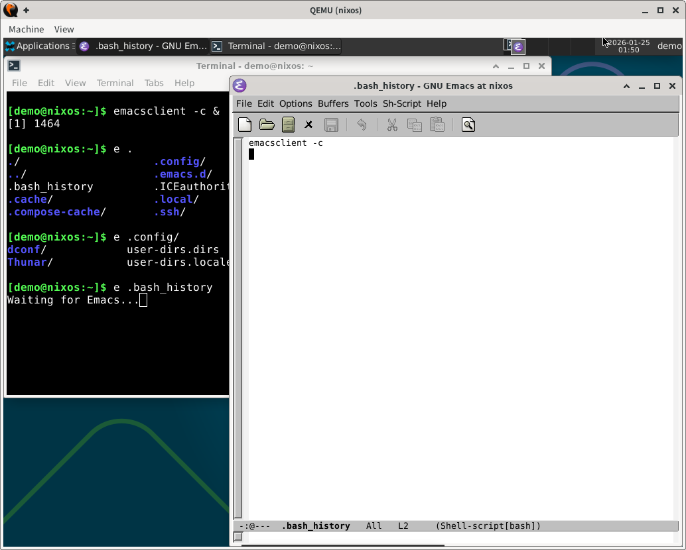

*** ファイルを開く
同様に、 =e something.txt= でファイルを開くことができます。
開いたシェルに制御を返すには =C-x #= で編集終了を伝えることができます。

#+begin_src shell
e something.txt
#+end_src

*** emacsclientの主要オプション
**** -c (--create-frame)
新しいフレームを作成して開きます。

#+begin_src shell
e -c file.txt
#+end_src

**** -t (--tty)
ターミナル内でEmacsを開きます。

#+begin_src shell
e -t file.txt
#+end_src

**** -n (--no-wait)
ファイルを開いた後、すぐにシェルに制御を返します。
デフォルトではemacsclientは編集が終わるまで待機しますが、このオプションを付けることでバックグラウンドで開くことができます。

#+begin_src shell
e -n file.txt
#+end_src

*** サーバーの状態確認
Emacsサーバーが正常に動作しているか確認するには =systemctl= を使います。

#+begin_src shell
systemctl --user status emacs
#+end_src

サーバーを手動で再起動したい場合:

#+begin_src shell
systemctl --user restart emacs
#+end_src

*** トラブルシューティング
**** サーバーが起動しない
まずログを確認します。

#+begin_src shell
journalctl --user -u emacs
#+end_src

多くの場合、Emacsの設定ファイル（init.el）にエラーがあることが原因です。
Emacsを通常起動して設定を修正した後、サーバーを再起動します。

**** 複数のサーバーが動いている
何らかの理由で複数のEmacsサーバーが起動してしまった場合、以下のコマンドで全て停止できます。

#+begin_src shell
systemctl --user stop emacs
pkill -u $USER emacs
#+end_src

その後、サーバーを再起動します。

#+begin_src shell
systemctl --user start emacs
#+end_src

**** クリップボードの共有
QEMU VM上でコピーした内容をホスト側でも使えるようにするには、QEMUのGTKバックエンドを使用します。

VM起動時のQEMU_OPTSに =-display gtk= を追加するだけです:

#+begin_src shell
QEMU_OPTS="-m 8192 -smp 4 -display gtk" nix run
#+end_src

これでVM内でコピーした内容がホスト側のクリップボードにも反映されるようになります。

**** tips
どういう設定がされているのか見てみると楽しいです。

systemdのユニットファイルを確認:

#+begin_src shell
systemctl --user cat emacs
#+end_src

環境変数EDITORの内容を確認:

#+begin_src shell
$ echo $EDITOR
emacseditor

$ which $EDITOR
/run/current-system/sw/bin/emacseditor

$ cat $(which $EDITOR)
#!/nix/store/lw117lsr8d585xs63kx5k233impyrq7q-bash-5.3p3/bin/bash
if [ -z "$1" ]; then
  exec /nix/store/3gh804i02baai4yvn4vz99hs4ncvxjdd-emacs-30.2/bin/emacsclient --create-frame --alternate-editor /nix/store/3gh804i02baai4yvn4vz99hs4ncvxjdd-emacs-30.2/bin/emacs
else
  exec /nix/store/3gh804i02baai4yvn4vz99hs4ncvxjdd-emacs-30.2/bin/emacsclient --alternate-editor /nix/store/3gh804i02baai4yvn4vz99hs4ncvxjdd-emacs-30.2/bin/emacs "$@"
fi
#+end_src

=emacsclient= を簡単にラップした =emacseditor= というシェルスクリプトが動いていることが分かります。

** まとめ
NixOSの =services.emacs= を利用することで、emacsclientの環境を簡単に構築できます。
emacsclientに興味がありながらも上手く設定できずに悩んでいた人におすすめです。

* Emacs posframe入門
:properties:
:export_file_name: generated/contents/blog/2025/ba3a31
:export_date: 2025-12-17
:end:

posframeはEmacsで独立したポップアップを表示するパッケージです。
裏では単にフレームが使われています。

このフレームに対してミニバッファを消したりモードラインを消したりしてポップアップ「らしさ」を調整し、さらにいろいろなハンドリング関数を追加したものがposframeです。
特にウィンドウ分割関係なく自由な位置に配置できるため、このposframeを使うことで簡単に「Emacsでは通常不可能なリッチな表示」が可能となります。
[[https://melpa.org/#/?q=posframe&sort=downloads&asc=false][posframeに依存しているパッケージ一覧]]を見るとそのイメージが掴みやすいと思います。

ではposframeを触っていきましょう。

** posframeことはじめ
まずここから始めます。

#+begin_src elisp
(leaf posframe :ensure t :require t)
;;=> posframe

(posframe-workable-p)
;;=> t

(posframe-show " *my-posframe-buffer*"
               :string "This is a test"
               :position (point))
;;=> #<frame *scratch* 0xb3c235c30>

(posframe-hide " *my-posframe-buffer*")
;;=> nil
#+end_src

leafでインストールします。
=(posframe-workable-p)= が =t= であることが必要です。
=posframe-show= で表示して =posframe-hide= で隠します。以上です。

** 装飾をしてみよう
posframe-showは以下のような引数を受け取ることができます。

#+begin_src elisp
(cl-defun posframe-show (buffer-or-name
                         &key
                         string
                         position
                         poshandler
                         poshandler-extra-info
                         width
                         height
                         max-width
                         max-height
                         min-width
                         min-height
                         x-pixel-offset
                         y-pixel-offset
                         left-fringe
                         right-fringe
                         border-width
                         border-color
                         internal-border-width
                         internal-border-color
                         font
                         cursor
                         tty-non-selected-cursor
                         window-point
                         foreground-color
                         background-color
                         respect-header-line
                         respect-mode-line
                         initialize
                         no-properties
                         keep-ratio
                         lines-truncate
                         override-parameters
                         timeout
                         refresh
                         accept-focus
                         hidehandler
                         refposhandler
                         &allow-other-keys)
#+end_src

いくつか使ってみるとposframeを装飾することができます。

#+begin_src elisp
(posframe-show " *my-posframe-buffer*"
               :string "表示するテキスト"
               :position (point)
               :background-color "#282a36"
               :foreground-color "#f8f8f2"
               :border-width 1
               :border-color "#6272a4")
#+end_src

** もっとリッチなposframeを表示したい
posframeの装飾はposframe自体の装飾とposframeが表示するバッファに分かれます。
posframe自体の装飾は常識的な範囲に滞まっているので、

* bunsai — Docker不要、単一バイナリのAWSエミュレータをBunで書いた
:properties:
:export_file_name: generated/contents/blog/2026/2653f0
:export_date: 2026-06-14
:end:

ローカル開発やCIでAWSをモックするとき、長らくLocalStackが定番でした。
Docker daemonを立てて、 =localstack/localstack= を =docker run= して、 =--endpoint-url= をSDKに食わせる、というやつです。

このやり方の不満をBunで全部書き直したのが [[https://github.com/conao3/bun-bunsai][bunsai]] です。
本記事ではv1.3.0 ( =@conao3/bunsai@1.3.0= )を題材に、何ができて何が違うかを実機で確認しながら紹介します。

** 何が違うのか
LocalStackと比べた構造的な差は次の3点です。

1. *Docker不要・単一バイナリ起動*。 =bunx @conao3/bunsai= またはGitHub Releasesのlinux-x64 / darwin-arm64バイナリを直接実行できます。コールドスタートは手元で約0.7-1.4秒、RSSは237MB程度。LocalStack 3.8.1の =docker run= は同条件で約3.88秒・404MBでした。
2. *Web dashboardがApache-2.0で同梱*。LocalStackのResource BrowserはPro限定のSaaS ( =app.localstack.cloud= )ですが、bunsaiは =http://localhost:4566/= をブラウザで開くと自前のReact 19製ダッシュボードが立ち上がります。
3. *Lambdaを実プロセスで実行*。Node.jsはBunが直接ハンドラを読み込むので低レイテンシ。Python / Ruby / Java / .NET / Go ( =provided.al*= )はホストにインストールされた言語ランタイムを =Bun.spawn= で起動します。LocalStackがDocker内のLambdaランタイムイメージを別途起動するのに対し、bunsaiは「ホストの =python3= を直接叩く」シンプルな経路です。

** 起動してみる
依存はBunだけです。fresh dirで:

#+begin_src sh
mkdir bunsai-demo && cd bunsai-demo
bun add @conao3/bunsai@1.3.0
bunx bunsai
# bunsai listening on http://localhost:4566/
#   AWS gateway:    POST/GET http://localhost:4566/ (any signed AWS request)
#   Management API: http://localhost:4566/__bunsai/*
#   Dashboard:      http://localhost:4566/__dashboard/
#+end_src

ポートは =4566= の1本だけ。AWS gateway / management API / dashboardが同じoriginに同居していて、SigV4で署名されたリクエストはgatewayへ、 =/__bunsai/*= は管理API、ブラウザでルートを叩くと =/__dashboard/= に302 redirectされます。

AWS CLIから普通に叩けます:

#+begin_src sh
export AWS_ACCESS_KEY_ID=test AWS_SECRET_ACCESS_KEY=test AWS_DEFAULT_REGION=us-east-1
EU=http://localhost:4566

aws --endpoint-url $EU s3 mb s3://demo-bucket
aws --endpoint-url $EU s3 cp /etc/hostname s3://demo-bucket/hostname.txt
aws --endpoint-url $EU sqs create-queue --queue-name jobs
aws --endpoint-url $EU dynamodb create-table --table-name Users \
    --attribute-definitions AttributeName=id,AttributeType=S \
    --key-schema AttributeName=id,KeyType=HASH \
    --billing-mode PAY_PER_REQUEST
aws --endpoint-url $EU secretsmanager create-secret --name db/password \
    --secret-string '{"user":"admin","pass":"hunter2"}'
aws --endpoint-url $EU kms create-key
aws --endpoint-url $EU sns create-topic --name notifications
#+end_src

認証情報は =test= / =test= で構いません(SigV4署名は検証していません)。

** Dashboard
ここからが面白いところで、 =http://localhost:4566/= をブラウザで開くと、いま立てたリソースとリクエストがリアルタイムで見えます。

*** Overview
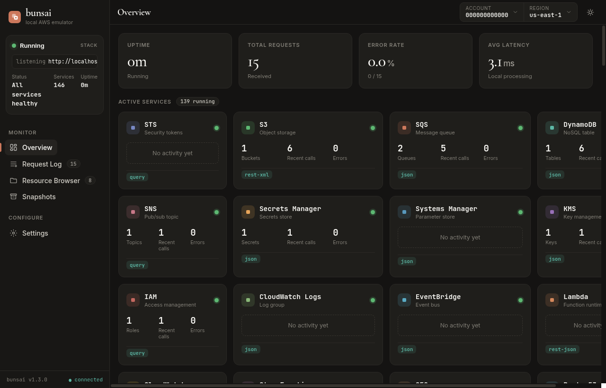

カードは「実際に呼び出した」「リソースを作った」サービス順に並び、 ``No activity yet'' のサービスは色味を抑えて表示されます。
左上のステータスサマリで全体のヘルスとUptime、上部にUptime / Total Requests / Error Rate / Avg Latencyの4つのKPIが出ます。

*** Resource Browser
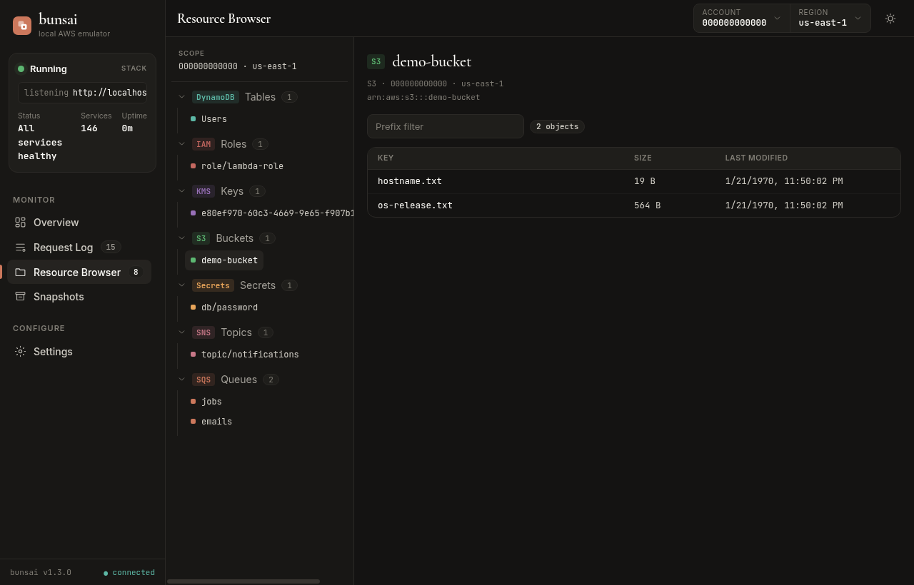

サービス横断のリソースツリーで、bucketを開けばオブジェクト一覧、queueを選べばapproximate countとmessage本文が、DynamoDBテーブルを選べば先頭5件のitemが見えます。
状態をブラウザで覗けるのはローカルAWSをやるなら必需品で、これがOSSのbunsaiにそのまま入っているのが大きな差別化軸です。

*** Request Log
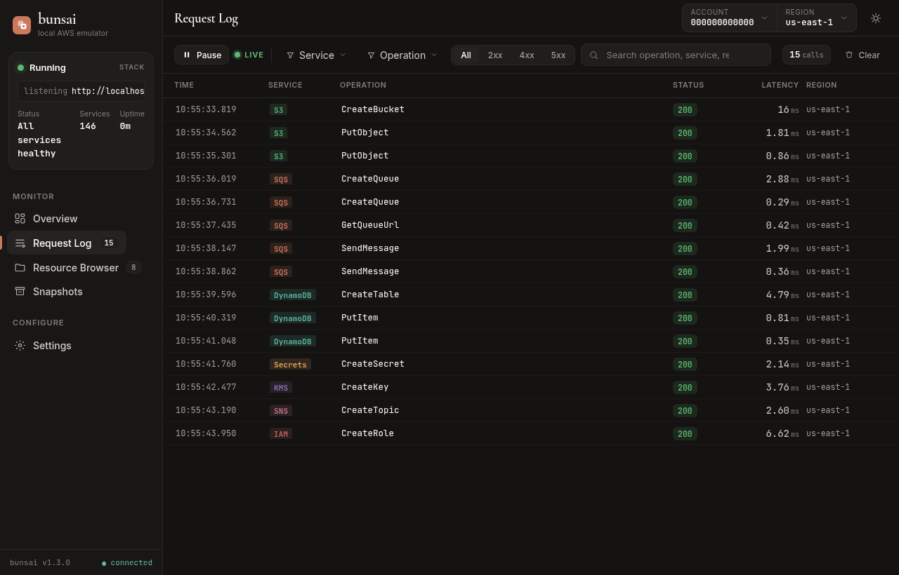

呼び出された全API callがSSEでライブストリームされ、service / operation / status / latencyで絞り込んだり検索したりできます。
1行クリックすると右ドロワー(または下部パネル、Settingsで切替可)で生ボディ・ヘッダ・パース後パラメータ・レスポンスが見えます。

** 多言語Lambda
LocalStackのCommunity版でもLambdaは動きますが、bunsaiはホスト直叩き方式を採っています。

#+begin_src sh
# Node.js — Bunが直接ハンドラを実行(低レイテンシ)
cat > index.mjs <<'EOF'
export const handler = async (e) => ({ statusCode: 200, hello: e.name ?? 'world' });
EOF
zip fn.zip index.mjs

aws --endpoint-url $EU lambda create-function --function-name hello \
    --runtime nodejs20.x --role arn:aws:iam::000000000000:role/r \
    --handler index.handler --zip-file fileb://fn.zip

aws --endpoint-url $EU lambda invoke --function-name hello \
    --payload "$(echo -n '{"name":"bunsai"}' | base64)" /tmp/out.json
cat /tmp/out.json
# {"statusCode":200,"hello":"bunsai"}
#+end_src

Pythonを試したいなら =python3= がホストにあればOK:

#+begin_src sh
cat > lambda_function.py <<'EOF'
def lambda_handler(event, context):
    return {"statusCode": 200, "hello": event.get("name", "world")}
EOF
zip py.zip lambda_function.py

aws --endpoint-url $EU lambda create-function --function-name py-fn \
    --runtime python3.13 --role arn:aws:iam::000000000000:role/r \
    --handler lambda_function.lambda_handler --zip-file fileb://py.zip

aws --endpoint-url $EU lambda invoke --function-name py-fn \
    --payload "$(echo -n '{"name":"bunsai"}' | base64)" /tmp/out.json
#+end_src

ホストに =python3= が見つからない場合、bunsaiは正規のAWSエラー =Runtime.NotReady= を返します。 =BUNSAI_LAMBDA_PYTHON= / =_RUBY= / =_JAVA= / =_DOTNET= でインタプリタのパスを上書きできます。

| Runtime                  | 実行方法                                       |
|--------------------------+------------------------------------------------|
| =nodejs*=                | Bunが直接 =import()=                           |
| =python*=                | ホストの =python3= を =Bun.spawn=              |
| =ruby*=                  | ホストの =ruby= を =Bun.spawn=                 |
| =java*=                  | ホストの =java <source>.java= を =Bun.spawn=   |
| =dotnet*=                | ホストの =dotnet= を =Bun.spawn=               |
| =provided.al*= / =go1.x= | zip内の =bootstrap= を直接起動 + AWS Runtime APIシム |

Docker daemonを立ち上げなくていいので、CI runnerの =setup-python= や =setup-ruby= がそのまま使えます。

** サービスカバレッジ
bunsaiは146サービスをbotocoreのservice-2.jsonから取り込んで実装しています。
LocalStack OSS Community(35サービス)とdiffを取ったところ、 ``LocalStackで動くがbunsaiで動かない'' サービスは0でした(v1.2.0で =dynamodbstreams= / =resourcegroupstaggingapi= / =support= / =s3control= / =es= の5サービスを追加してギャップを閉じています)。

| 観点              | LocalStack OSS Community  | bunsai            |
|-------------------+---------------------------+-------------------|
| サービス数        | 35                        | 146               |
| Web Dashboard     | Pro限定SaaS               | 同梱 (Apache-2.0) |
| Lambda runtime    | Docker内のLambdaイメージ  | ホスト直接実行    |
| 起動時間          | ~3.88s (docker run cold)  | ~0.7-1.4s         |
| RSS               | ~404MB                    | ~237MB            |
| Docker依存        | あり                      | なし              |
| 配布形態          | Docker image / pip        | npm + 単一バイナリ |

** スコープ外
bunsaiの差別化のために割り切っている部分も書いておきます。

- *SigV4署名は検証しません*。credential pairは何でも通ります。
- *IAMポリシーの評価はしません*。CRUDだけです。
- *Lambdaのメモリ / CPU隔離なし*。ホストプロセスとして動くので、MemorySizeは記録するだけです。
- *rpcv2Cborは未対応*。AWS SDKがCBORを既定化したら追従予定です。
- *event-stream APIは未対応*(Kinesis =SubscribeToShard= 等)。

これらは「実装してもbunsaiの差別化を毀損する」「LocalStackと併用すれば足りる」ものを意図的に省いた結果です。

** 入手
3経路あります。

#+begin_src sh
# 1) bunx — Bunがあれば一発で起動
bunx @conao3/bunsai

# 2) npm install してCLI起動
npm install -g @conao3/bunsai
bunsai

# 3) GitHub Releasesの単一バイナリ
curl -fLo bunsai https://github.com/conao3/bun-bunsai/releases/latest/download/bunsai-linux-x64
chmod +x bunsai && ./bunsai
#+end_src

ライセンスはApache-2.0、リポジトリは [[https://github.com/conao3/bun-bunsai]] です。
Issue / PR大歓迎です。

* COMMENT Local variables
# Local Variables:
# org-download-image-dir: "./resources/public/img"
# End:
